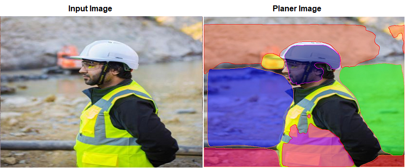

## Session 14 Assignment - Team Submission
Team Members
1. S.A.Ezhirko
2. Naga Pavan Kumar Kalepu
**********************************************************************************************************************
# **Monocular Depth Estimation and Segmentation** 
To obtain a depth information dataset, we need expensive hardwares like LIDAR's or depth Camera and collect the images. Intel have come up with their model that provides us the depth information for a given image. We will be using their model to generate depth information for our dataset.

     

### **:small_orange_diamond: Preparation of Dataset**
1. The dataset that was collected for training yolo model which contains 3590 images of people wearing Hardhat, Vest, Mask and Boots is being used in this assignment.
2. The ["Depth Estimation Repository"](https://github.com/intel-isl/MiDaS) contains pretrained model weight which we have used to convert our PPE image dataset into Depth map images.
3. The model outputs a grey-scale depth map of the given image. 
4. Open CV color map API was used to view the depth information as a color image. 
5. All the predicted depth images will be stored as grey-scale images in order to reduce the number of channels for the model in next assignment.
**********************************************************************************************************************
# **Planer CNN Model to generate Surface planes** 
Planer CNN generates plane surfaces for a given input image.

   

### **:small_orange_diamond: Preparation of Dataset**
1. The dataset that was collected for training yolo model which contains 3590 images of people wearing Hardhat, Vest, Mask and Boots is being used in this assignment.
2. The ["Planer CNN Repository"](https://github.com/NVlabs/planercnn) contains pretrained model weight which we have used to convert our PPE image dataset into surface plane images.
3. The model outputs a image with depth information and surface plane segmentation. 
4. Since depth information was taken from Midas model, the code was modified to generate only surface plane images. 
5. All the predicted images are stored along with their original image for comparision.
6. This model is heavily dependent on GPU, we have to install CUDA version supporting our GPU architecture and the supporting version pytorch 0.4.1 has to installed to run the model.
